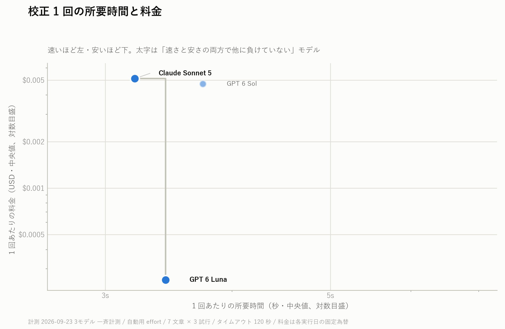
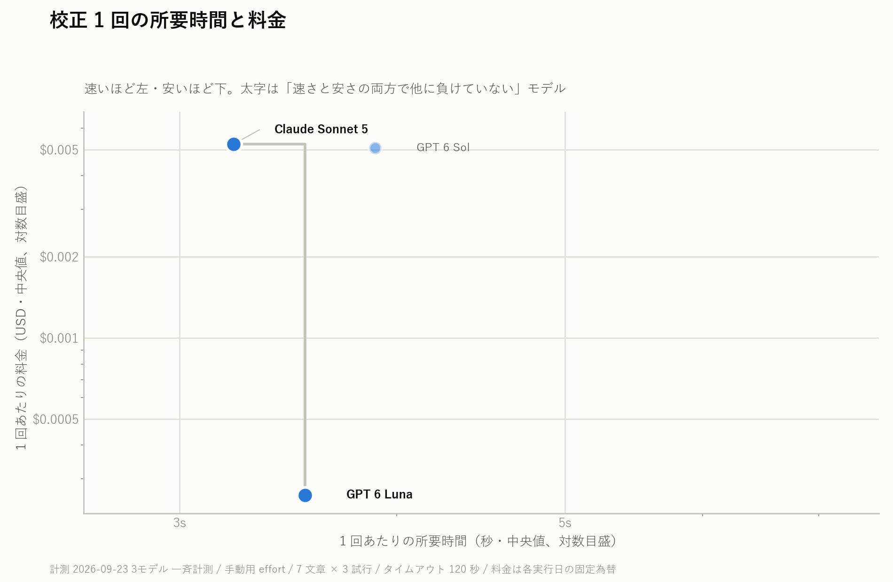
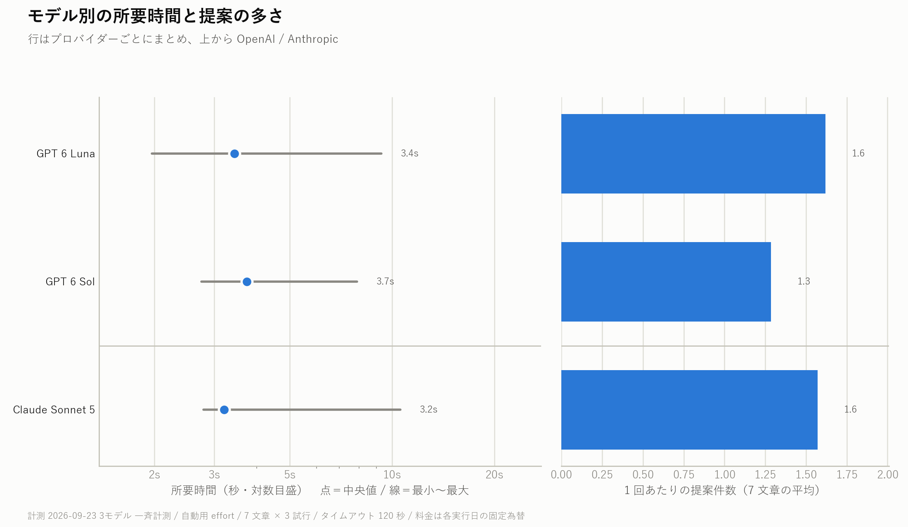
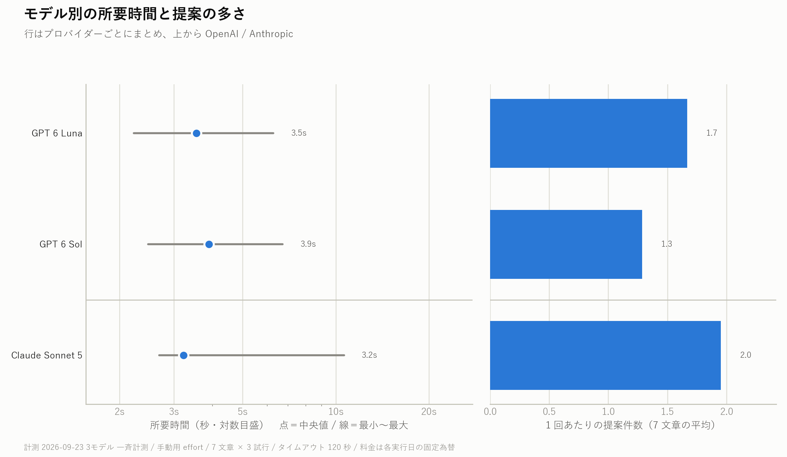

# 校正モデル比較：Sonnet 5・GPT 6 Luna・GPT 6 Sol（2026-09-23）

新規設定の自動校正・手動校正で使うモデルを決めるため、同じ日本語文章で3モデルを比較した。**この計測では両用途とも GPT 6 Luna を選んだ。** Luna は狙った誤字を Sonnet 5 と同程度に修正し、変更不要の文章を維持した。1回あたりの概算料金は Sonnet 5 の約20分の1だった。

**追補：** 新規追加の Claude Opus 5.5 は、後から同じ条件で[単独計測](claude-opus-5-5-benchmark-2026-09-23.md)した。結果の要約も[この文書の末尾](#claude-opus-55-の単独追補)に追記している。

生データ：[自動用 JSON](../results/benchmarks/model-benchmark-2026-09-23-automatic-r3.json)／[手動用 JSON](../results/benchmarks/model-benchmark-2026-09-23-manual-r3.json)。各モデル・各文章・各試行の修正後本文もこの JSON に含む。

## 計測条件

| 項目 | 内容 |
|---|---|
| 対象 | Claude Sonnet 5、GPT 6 Luna、GPT 6 Sol |
| 用途 | 自動用 `low` と手動用 `medium` を別々に計測 |
| 試行 | 7文章 × 3モデル × 3回 × 2用途＝**126リクエスト**。各用途・各モデルは21回 |
| 入力 | 同じ7文章、スタイルガイド・カスタム指示・few-shotなし。システム指示は557文字、SHA-256 `81e1f360d3ed8df3…` |
| タイムアウト | 全モデル共通で120秒。文章ごとに3モデルへ順番に送信 |
| 結果 | 126件すべて成功。再試行、安全検査での破棄、保護文字列の違反は0件 |
| 料金 | 応答のトークン使用量と登録単価によるUSD概算。キャッシュ利用を報告した試行は0件。自動用合計 **$0.2072627**、手動用合計 **$0.2299522** |

## 所要時間と料金

左ほど速く、下ほど安い。**各点は21回の中央値**で、両軸は対数目盛。太字の点は、この2指標だけで他のモデルに同時には負けていないことを示す。品質の順位を表す印ではない。

### 自動用



[ダーク版の図](../../docs/images/model-comparison-2026-09-23/automatic/model-benchmark-scatter-dark.png)

### 手動用



[ダーク版の図](../../docs/images/model-comparison-2026-09-23/manual/model-benchmark-scatter-dark.png)

| 用途 | モデル | 所要時間中央値 | 1回あたり概算料金中央値 | 21回の概算合計 |
|---|---|---:|---:|---:|
| 自動 | **GPT 6 Luna** | 3.440秒 | **$0.000255** | **$0.005123** |
| 自動 | Claude Sonnet 5 | **3.207秒** | $0.005112 | $0.107346 |
| 自動 | GPT 6 Sol | 3.742秒 | $0.004728 | $0.094794 |
| 手動 | **GPT 6 Luna** | 3.543秒 | **$0.000261** | **$0.005562** |
| 手動 | Claude Sonnet 5 | **3.221秒** | $0.005232 | $0.123496 |
| 手動 | GPT 6 Sol | 3.887秒 | $0.005064 | $0.100894 |

Sonnet 5 の中央値は Luna より自動用で約0.23秒、手動用で約0.32秒速い。一方、料金中央値は両用途とも Luna の約20倍だった。通信状態を含む1日の少数試行なので、この秒差を恒常的な性能差とは扱わない。

### 時間のばらつきと提案件数

点は所要時間の中央値、横線は最小～最大。右側の棒は7文章での**提案件数の平均**であり、正解数ではない。原文に不要な説明を足した場合も提案として数えられる。



[ダーク版の図](../../docs/images/model-comparison-2026-09-23/automatic/model-benchmark-bars-dark.png)



[ダーク版の図](../../docs/images/model-comparison-2026-09-23/manual/model-benchmark-bars-dark.png)

## 修正内容の比較

以下は提案件数ではなく、**全提案を適用した後の本文**を原文・狙った修正と照合した結果。`3/3` は同じ文章の3試行すべてで条件を満たした意味。変更不要は口語文と技術文書の計6試行、保護対象は引用内の意図的な誤字と本文中の指示の計6試行を指す。

| 用途・モデル | 誤字7箇所を全修正 | 混在文3箇所を全修正 | 変更不要の原文を維持 | 保護文字列を維持 | 二重敬語を修正 |
|---|---:|---:|---:|---:|---:|
| 自動・**GPT 6 Luna** | 3/3 | **3/3** | **6/6** | 6/6 | 0/3 |
| 自動・Claude Sonnet 5 | 3/3 | **3/3** | **6/6** | 6/6 | 0/3 |
| 自動・GPT 6 Sol | 3/3 | 0/3 | **6/6** | 6/6 | 0/3 |
| 手動・**GPT 6 Luna** | 3/3 | **3/3** | **6/6** | 6/6 | 0/3 |
| 手動・Claude Sonnet 5 | 3/3 | **3/3** | 2/6 | 6/6 | 0/3 |
| 手動・GPT 6 Sol | 3/3 | 0/3 | **6/6** | 6/6 | 0/3 |

- `mixed` では、Sol は「上廻った」と「仕組も」を3回とも残した。Luna と Sonnet 5 は3箇所をすべて修正した。
- Luna は誤字7箇所をすべて直した一方、「候補が上がっています」→「候補が挙がっています」という追加の表記提案も自動用で1/3、手動用で2/3回出した。最小限の修正だけを常に返すわけではない。
- 手動用 Sonnet 5 は、誤りのない技術文書に3回とも「誤字・脱字は見当たりませんでした」などの説明文を付け、口語文でも1回余計な前置きを付けた。説明文も修正後の本文として扱われ、不要な差分が発生した。
- ビジネスメールでは3モデルとも脱字「可能となりした」は毎回直したが、二重敬語「ご覧になられてください」は毎回残した。この計測は、どのモデルもすべての誤りを検出できると示すものではない。
- 保護文字列は全モデル・両用途で維持された。ただし、検査対象は2文章に指定した文字列だけである。

## 判断と適用範囲

Luna はこの7文章で Sonnet 5 と同等の主要な修正を行い、手動用では不要な説明文の追加も避けた。Sol は混在文の取りこぼしが続いた。速度の中央値は3モデルとも約3～4秒で、Luna の料金差が大きい。この結果から、**新規設定の自動用・手動用を GPT 6 Luna** とした。保存済みのユーザー選択は維持する。

この結果は短い合成文章、各条件3試行、同日・同一プロンプトでの比較に限る。長文、複数段落、個別のスタイルガイド、実際の文章分布での精度は測っていない。料金はアプリの概算方式で、実請求額の上限ではない。

## Claude Opus 5.5 の単独追補

新しく追加した Claude Opus 5.5 は上記の3モデル同時比較には含まれていなかったため、**同じ7文章・指示・試行数・タイムアウトで別途単独計測**した。自動用21回と手動用21回はすべて成功し、概算合計は **$0.473980** だった。

| 用途 | 所要時間中央値 | 1回あたり概算料金中央値 | 誤字7箇所を全修正 | 混在文3箇所を全修正 | 変更不要の原文を維持 |
|---|---:|---:|---:|---:|---:|
| 自動・Claude Opus 5.5 | 4.109秒 | $0.010328 | 3/3 | 0/3 | 6/6 |
| 手動・Claude Opus 5.5 | 5.566秒 | $0.012248 | 3/3 | 0/3 | 6/6 |

混在文では「上廻った」と「仕組も」を残し、この項目は GPT 6 Sol と同じ結果だった。GPT 6 Luna と Claude Sonnet 5 は両用途で3箇所をすべて直した。Opus 5.5 の計測は別の時間帯なので、所要時間の小さな差を同日・同時の速度差とは扱わない。修正後本文、保護文字列の結果、4モデルの比較表は[Opus 5.5 追補レポート](claude-opus-5-5-benchmark-2026-09-23.md)を参照。

## 再生成

既存JSONから図を作る操作はAPIを呼ばず、料金も発生しない。

```powershell
python tools/plot-model-benchmark.py --input PromptValidation/results/benchmarks/model-benchmark-2026-09-23-automatic-r3.json --output-dir docs/images/model-comparison-2026-09-23/automatic
python tools/plot-model-benchmark.py --input PromptValidation/results/benchmarks/model-benchmark-2026-09-23-manual-r3.json --output-dir docs/images/model-comparison-2026-09-23/manual
```

計測コマンドと料金上限の扱いは[PromptValidation の README](../README.md)を参照。ベンチマークの再実行は有料APIを呼ぶ。
