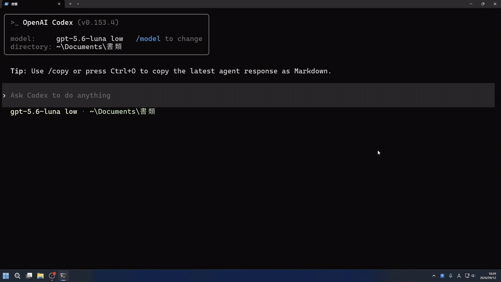

# JP Scratch

**キーひとつで開いて、キーひとつで消える軽量なメモ帳です。**

JP Scratch は `Alt + Space` で手前に呼び出せるメモ帳で、 `Ctrl + Alt + Enter` で
全文をコピーしながら消えます。

書いた文章は AI に校正させることもできます。APIキー、キー不要のOpenAI API互換接続先、ChatGPT / GitHub Copilotのサブスクを使用できます。

## 機能

* `Alt + Space` でどこからでも呼び出せる
* `Ctrl + Alt + Enter` で全文をコピーしながら消え、元のアプリにフォーカスが戻る
* AI に文章を校正させることができる（APIキー、キー不要の互換接続先、またはChatGPT / GitHub Copilot のサブスクを使用）
* タスクトレイに常駐。待機時のCPU使用率は測定上0.00%、メモリ使用量は約29 MiBです（Windows 11／v2.0.0）。

キーバインドは任意のものに変更することができます。

## インストール

Windows 11（x64）で使用できます。

[Releaseページ](https://github.com/Ringoacid/jp-scratch/releases/latest)からインストーラーをダウンロードしてください。インストーラーには以下の二種類があります。

* JpScratch-x.x.x-selfcontained.msi
* JpScratch-x.x.x.msi

`JpScratch-x.x.x-selfcontained.msi` は、.NETランタイムという、アプリを動かすためのソフトウェアがインストールされていない環境でも動作するように、必要なものをすべて含んだインストーラーです。通常はこちらをインストールしてください。`JpScratch-x.x.x.msi` は、.NET 10 Desktop Runtime（x64）がインストールされている環境でのみ動作するインストーラーです。

## 使い方

インストールしたら、スタートメニューから JP Scratch を起動してください。設定は、ウィンドウ上部の設定ボタンか、タスクトレイのアイコンを右クリックして開くことができます。

AI校正を使うには、APIキー、キー不要の互換接続先、またはサブスクの接続設定が必要です。設定していなくても、メモ帳として使うことができます。

* [基本操作・AI校正の使い方](docs/how-to-use.md)
* [ChatGPT / GitHub Copilotのサブスクを使う](docs/subscription-backends.md)
* [保存場所・バックアップ・困ったとき](docs/data-and-support.md)
* [AI校正モデルの選び方（全モデルの比較とおすすめ）](docs/ai-model-guide.md)
* [AI校正モデルの比較データ（検証結果）](PromptValidation/model-benchmark-2026-09-23.md)

ソースコードからビルドする場合は、[ビルド方法・インストーラー作成方法](docs/how-to-build.md)を参照してください。
