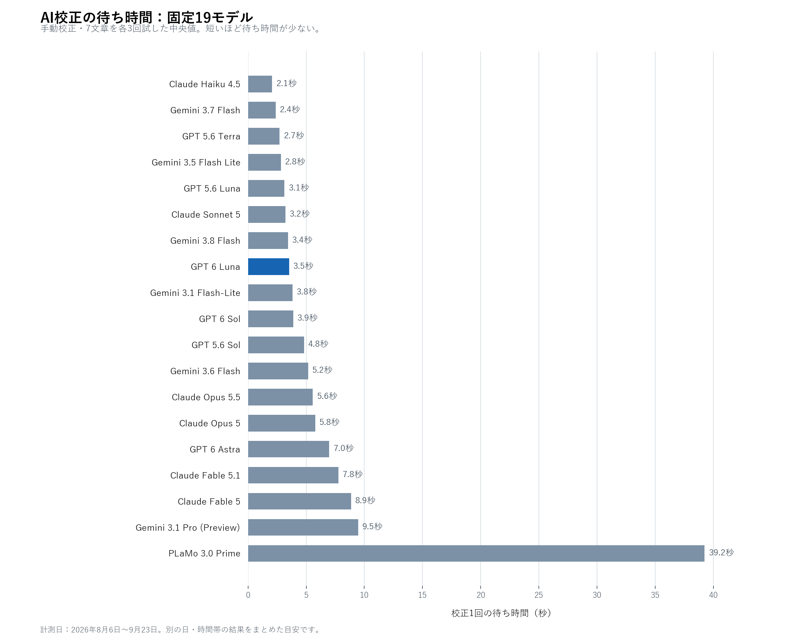

# AI校正モデルの選び方

JP Scratch で選べる固定の API モデル **19種類**を、料金と校正時の待ち時間で比べます。**迷ったら GPT 6 Luna** がおすすめです。新しく設定した場合、自動校正・手動校正の両方でこのモデルが選ばれます。

## 全19モデルの比較

下の図と表には、アプリに登録された**固定モデルをすべて**掲載しています。図は手動校正の待ち時間です。表の「入力／出力」はそれぞれ**100万トークン当たりのアプリ登録単価**で、「引用維持」は引用中の意図的な誤字を変えなかった回数を表します。`3/3` は3回とも維持した意味です。

| モデル | 提供元 | 入力／出力 | 待ち時間の中央値 | 引用維持 |
|---|---|---:|---:|---:|
| **GPT 6 Luna** | OpenAI | **$0.10／$0.50** | 3.5秒 | 3/3 |
| GPT 6 Sol | OpenAI | $2／$10 | 3.9秒 | 3/3 |
| GPT 6 Astra | OpenAI | $10／$50 | 7.0秒 | 3/3 |
| GPT 5.6 Luna | OpenAI | $0.20／$1.20 | 3.1秒 | 1/3 |
| GPT 5.6 Terra | OpenAI | $2／$12 | 2.7秒 | 2/3 |
| GPT 5.6 Sol | OpenAI | $4／$20 | 4.8秒 | 3/3 |
| Gemini 3.1 Pro (Preview) | Google | $2／$12 | 9.5秒 | 3/3 |
| Gemini 3.6 Flash | Google | $0.75／$3.75 * | 5.2秒 | 3/3 |
| Gemini 3.7 Flash | Google | $0.75／$3.75 * | 2.4秒 | 3/3 |
| Gemini 3.8 Flash | Google | $0.75／$3.75 * | 3.4秒 | 3/3 |
| Gemini 3.1 Flash-Lite | Google | $0.25／$1.50 | 3.8秒 | 0/3 |
| Gemini 3.5 Flash Lite | Google | $0.30／$2.50 | 2.8秒 | 3/3 |
| Claude Fable 5 | Anthropic | $10／$50 | 8.9秒 | 3/3 |
| Claude Fable 5.1 | Anthropic | $10／$50 | 7.8秒 | 3/3 |
| Claude Opus 5 | Anthropic | $5／$25 | 5.8秒 | 3/3 |
| Claude Opus 5.5 | Anthropic | $4／$20 | 5.6秒 | 3/3 |
| Claude Sonnet 5 | Anthropic | $2／$10 | 3.2秒 | 3/3 |
| Claude Haiku 4.5 | Anthropic | $1／$5 | 2.1秒 | 3/3 |
| PLaMo 3.0 Prime | Preferred Networks | **¥60／¥250** | 39.2秒 | 0/3 |

**計測日の注意：** 待ち時間と引用維持は、2026年**8月6日～9月23日の別の日・別の時間帯**に測った結果をまとめています。同じ7文章を各モデルで3回ずつ、手動用の設定・120秒のタイムアウトで試しました。通信状況や提供元の更新によって変わるため、秒数の小さな差を厳密な順位として扱わないでください。GPT 6 Luna・Sol・Claude Sonnet 5 は9月23日に一緒に計測し、Claude Opus 5.5 は同日に単独で追加計測しました。それ以外は8月6日～9月7日の計測です。表の単価は**2026年9月23日時点のアプリ登録値**で、過去の計測時の単価と異なる場合があります。

\* Gemini 3.6・3.7・3.8 Flash は[2026年12月31日までの導入価格](https://ai.google.dev/gemini-api/docs/latest-model)です。アプリにはその後の通常単価 $1.50／$7.50 も登録されています。PLaMo だけ円建てで、ドル建てモデルとの料金の大小はこの表から直接は比べられません。

## どれを選ぶ？

**最初に選ぶなら GPT 6 Luna** を勧めます。9月23日に GPT 6 Sol・Claude Sonnet 5 と同じ文章で比較したところ、主な誤字の修正では Sonnet 5 と同程度の結果で、修正不要の文章も維持しました。Sol は混在文の誤りを取りこぼし、Sonnet 5 は手動校正で不要な説明文を加えることがありました。単独で追加計測した Opus 5.5 も、混在文の同じ2箇所を残しました。Luna の校正1回の概算料金の中央値は Sonnet 5 の約20分の1、Opus 5.5 の約47分の1でした。4モデルとも、試した二重敬語は修正できていません。[3モデルの比較](../PromptValidation/model-benchmark-2026-09-23.md)と[Opus 5.5 の単独追補](../PromptValidation/claude-opus-5-5-benchmark-2026-09-23.md)で詳細を確認できます。

Google の API キーを使うなら **Gemini 3.7 Flash または 3.8 Flash**、Anthropic なら **Claude Haiku 4.5** が候補です。それぞれの短文テストでは誤字を直し、引用中の意図的な誤字を維持しました。これらは GPT 6 Luna と同日には比べていないため、品質や速度でどちらが上かは断定できません。

引用や修正指示が多い文章では、表の「引用維持」を特に確認してください。GPT 5.6 Luna・Terra、Gemini 3.1 Flash-Lite、PLaMo 3.0 Prime は、この短文テストで意図的な誤字を変更した回がありました。どのモデルでも、提案は適用前に確認してください。

## 料金と接続先について

- 表の単価は**アプリに登録されている参考値**です。入力する文章だけでなく、指示文・返答・思考トークンも料金に影響します。実際の請求額は提供元で確認してください。
- アプリは**キャッシュ料金を計算しません**。キャッシュ読み込み割引が適用されると表示額が実際より高くなることがあります。一方、キャッシュ書き込みの割増や追加料金などで実際の請求額が上回る場合もあり、表示額は上限ではありません。
- **OpenAI API互換**では接続先を複数登録でき、モデル名と入力・出力の単価を自分で指定します。LM Studio や OpenRouter などの接続先にも使えます。モデルと料金が接続先ごとに異なるため、固定19モデルの表には含めていません。[設定方法](how-to-use.md#openai-api互換の接続先)を参照してください。
- **ChatGPT／GitHub Copilot の契約サービス**で表示されるモデルは、接続したアカウントによって変わります。APIの単価表とは別の利用枠で動くため、この表の料金は適用されません。[契約サービスの説明](subscription-backends.md)を参照してください。

単価を確認する：[OpenAI](https://developers.openai.com/api/docs/pricing)、[Google](https://ai.google.dev/gemini-api/docs/pricing)、[Anthropic](https://platform.claude.com/docs/en/about-claude/pricing)、[PLaMo](https://plamo.preferredai.jp/api)。表の元データは[アプリのモデル一覧](../Models/ProofreadingModelCatalog.cs)です。

計測の詳細：[初回11モデル](../PromptValidation/model-benchmark-2026-08-06.md)／[Gemini 3.7 Flash](../PromptValidation/gemini-3.7-flash-benchmark-2026-08-21.md)／[9月4日の追補データ](../PromptValidation/results/model-benchmark-2026-09-04-supplement-r3.json)／[GPT 6 Astra](../PromptValidation/gpt-6-astra-benchmark-2026-09-07.md)／[9月23日の3モデル比較](../PromptValidation/model-benchmark-2026-09-23.md)／[Opus 5.5 単独追補](../PromptValidation/claude-opus-5-5-benchmark-2026-09-23.md)。
